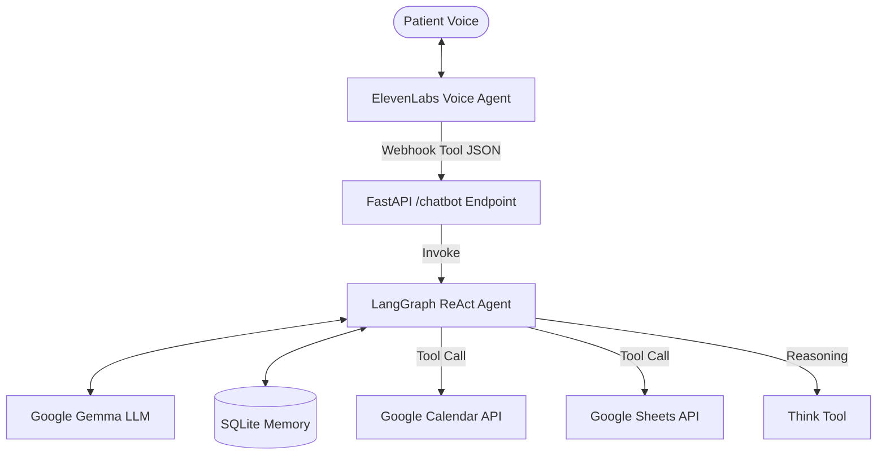

# 📞 Intelligent Voice Appointment Agent (LangGraph + Google GenAI)

Welcome! This repository contains a production-grade backend for an AI Voice Agent. It is designed to work with **ElevenLabs**, allowing a voice-based AI to book appointments, check Google Calendar availability, and log patient details to Google Sheets.

Unlike simple scripts, this backend uses **LangGraph** and **Google Gemma** to "think" through requests. If a patient asks for a time that is busy, the agent intelligently searches for alternatives before responding.

---

## 🏗️ How it Works



1. **ElevenLabs** acts as the voice and conversational interface.
2. When the user asks about an appointment, ElevenLabs triggers a **Webhook Tool**.
3. Our backend (FastAPI) receives the request at a unified `/chatbot` endpoint.
4. A **LangGraph ReAct Agent** (powered by Gemma) takes over, "thinks," and uses local tools to query Google APIs.
5. The agent returns a clean JSON response that ElevenLabs uses to speak back to the patient.

---

## 🛠️ Tech Stack
- **Framework**: FastAPI (Python)
- **AI Orchestration**: LangGraph
- **LLM**: Google Gemma (via Google GenAI)
- **Memory**: SQLite (Persistent thread-based checkpoints)
- **Services**: Google Calendar API, Google Sheets API

---

## 🚀 Sequential Setup Guide

### 1. Google Cloud Setup (Critical)
To allow the agent to read/write to your Calendar and Sheets, you need an OAuth2 Client:
1. Go to the [Google Cloud Console](https://console.cloud.google.com/).
2. Create a new project.
3. Enable **Google Calendar API** and **Google Sheets API**.
4. Go to **APIs & Services > Credentials**.
5. Click **Create Credentials > OAuth client ID**. Select **Desktop App**.
6. Download the resulting JSON file and rename it to **`client_secret.json`**.
7. Place `client_secret.json` in the root of this project.

### 2. Local Environment Setup
1. **Install Dependencies**:
    We recommend using `uv` for fast package management, but `pip` works too:
    ```bash
    uv pip install -r pyproject.toml
    ```
2. **Environment Variables**:
   Create a `.env` file in the root directory and add your keys:
   ```env
   GOOGLE_API_KEY=your_google_gemini_api_key
   GOOGLE_CALENDAR_ID=primary
   GOOGLE_SHEET_ID=your_extracted_sheet_id
   ```
   > **How to get your GOOGLE_SHEET_ID?**
   > Open your Google Sheet in a browser. The ID is the long string of letters and numbers in the URL between `/d/` and `/edit`.
   > *Example:* if URL is `.../d/1abc123_XYZ/edit`, then your ID is `1abc123_XYZ`.

### 3. Generate Token (`auth_setup.py`)
Because we are running locally, we need to perform the initial "handshake" with Google.
1. Run the setup script:
   ```bash
   python auth_setup.py
   ```
2. This will open your web browser. Log in with your Google account and grant permissions.
3. This creates a **`token.json`** file. This file stores your access for future runs so you don't have to log in every time.

### 4. Expose Local Server (`ngrok`)
ElevenLabs needs an internet-accessible URL to hit your local machine.
1. Download [ngrok](https://ngrok.com/).
2. Start your FastAPI server:
   ```bash
   python main.py
   ```
3. In a NEW terminal, expose port 8000:
   ```bash
   ngrok http 8000
   ```
4. Copy the **Forwarding URL** (e.g., `https://a1b2-c3d4.ngrok-free.app`). 

### 5. ElevenLabs Dashboard Setup
Please refer **Voice Agents Setup Guide.pdf** for more details. For each tool (`get_availability`, `create_appointment`, `log_patient_details`):
1. Go to the **Tools** section in ElevenLabs.
2. If you are starting fresh, import the provided `.json` files in this repo (e.g., `get_availability.json`).
3. Locate the `url` field inside the JSON.
4. **Replace `<REPLACE WITH THE WEBHOOK URL>` with your ngrok URL + `/chatbot`.**
   *   *Example:* `https://a1b2-c3d4.ngrok-free.app/chatbot`
5. Save the tool.

---

## 🔐 Security Warning
**NEVER check the following files into GitHub or share them:**
- `client_secret.json`: Your Google ID secret.
- `token.json`: Your personal access token.
- `.env`: Your Google API Key.
- `app_memory.db`: Your local chat history database.

The `.gitignore` in this project is already pre-configured to ignore these files for your safety.

---

## 📝 Important Notes
*   **Twilio Setup**: Integrating a phone number via Twilio is out of scope for this specific repository. You can connect this backend to ElevenLabs directly for web-based voice testing.
*   **Human Handoff**: Advanced features like transferring the call to a human agent are not currently implemented and are part of future development cycles.

---

## 🏃 Running the Agent
Once setup is complete, simply run:
```bash
python main.py
```
You will see logs in your terminal every time the voice agent "thinks" or accesses the Google tools. Look for the `[THINK]` logs to see the agent's logic in action!
